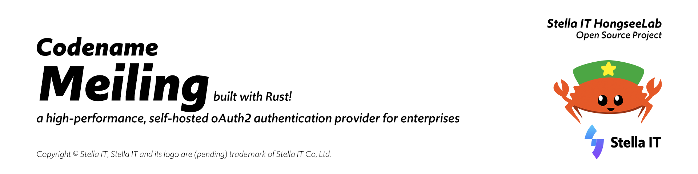

# Meiling
a high-performance, self-hosted oAuth2 Authentication Provider for enterprises

## Developers' Guide
### Rust Environment Configuration
#### Windows®
Follow [this direction](https://www.rust-lang.org/learn/get-started).

#### macOS and Linux
1. Install `gcc` on your platform
2. Install `rust` and `cargo` using `rustup`   
   [rustup can be installed from here](https://rustup.rs/)

#### Optional Rust Configuration
1. You can install [sccache](https://github.com/mozilla/sccache) for improved performance during builds.

### MariaDB Server Configuration
#### Windows®
Download [MySQL for Windows](https://dev.mysql.com/downloads/installer/).  
It will set it up for you.

#### macOS
Install mariadb using `brew install mariadb` and start server using `mysql.server start`.  

## How to run?
2. Run `cargo run`

## License
Hongfarm License (will be FOSS-compatible license later on).
